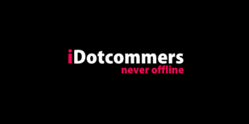

## About Project

The website iDotcommers was developed using Laravel 8 and serves as a static website with dynamic blog functionality. This project was completed within a month to meet the specific requirements of the client. External designs and effects were integrated to enhance the visual appeal and user experience. Additionally, a content management system and an admin panel were implemented to facilitate the seamless uploading of blogs, adding a dynamic element to the website.

For further exploration of iDotcommers' digital marketing services and offerings, you can visit their website at **idotcommers.com**.

## About Company

The website [iDotcommers](https://www.idotcommers.com/) is a digital marketing company based in Navi Mumbai. They offer full-stack online marketing services and are recognized as one of the top digital marketing companies in the region. iDotcommers specializes in providing comprehensive digital marketing solutions to help businesses enhance their online presence, reach their target audience effectively, and achieve their marketing goals.

With a focus on website development, residential and commercial projects, and a commitment to delivering quality services, iDotcommers caters to clients looking to establish a strong digital footprint. Their expertise extends to creating dynamic websites, managing online marketing campaigns, and optimizing digital strategies for businesses in Navi Mumbai and Mumbai.

For more information about iDotcommers and their digital marketing services, you can visit their website at [idotcommers.com](https://www.idotcommers.com/).

Citations:
[1] https://www.idotcommers.com
[2] https://www.idotcommers.com/contact/
[3] https://www.idotcommers.com/website/4/
[4] https://www.idotcommers.com/about-us/

https://github.com/princeidot/iDotcommers/assets/131530732/2c266a7e-7329-442a-ba86-42f93fd029ab

## About Admin Panel
The admin panel of iDotcommers Digital LLP provides a comprehensive platform for managing various aspects of the website and digital marketing projects. Within the admin panel, users can perform tasks such as adding and editing blogs, managing contact form data, following up on similar package data, documenting completed projects and client achievements, categorizing content, assigning authors, and editing or deleting entries as needed.

Additionally, the admin panel allows for website audit forms to be accessed and reviewed. This feature enables users to analyze website performance, identify areas for improvement, and optimize the site's functionality and user experience.

For more information about iDotcommers Digital LLP and their digital marketing services, you can visit their LinkedIn page at [iDotcommers Digital LLP - LinkedIn](https://in.linkedin.com/company/idotcommers) or their website at [idotcommers.com](https://www.idotcommers.com/).

https://github.com/princeidot/iDotcommers/assets/131530732/e6eeea86-5696-4d2f-adc0-38b8537fa491

## About CRM

The CRM developed by iDotcommers Digital LLP serves as a robust lead management system designed to streamline and optimize the lead handling process. Within this CRM, users have the capability to categorize leads into various categories such as sub-admin, dead leads, and warm leads. This segmentation allows for efficient lead tracking and management.
Users can edit lead information, prioritize warm leads for immediate follow-up, and take necessary actions to nurture and convert leads effectively. The CRM empowers users to maintain an organized list of leads, track interactions, and implement strategies to enhance lead conversion rates.

By incorporating features like sub-admin access, lead categorization, and action tracking, the iDotcommers CRM provides a comprehensive solution for managing leads efficiently and maximizing conversion opportunities.

For more information about iDotcommers Digital LLP and their CRM solutions, you can visit their LinkedIn page at iDotcommers Digital LLP - LinkedIn or their website at idotcommers.com.

https://github.com/princeidot/iDotcommers/assets/131530732/f6bf8477-ac61-483e-9e26-1a04cf411b69

https://github.com/princeidot/iDotcommers/assets/131530732/41059347-394b-4749-b6dc-56d029c8894c

